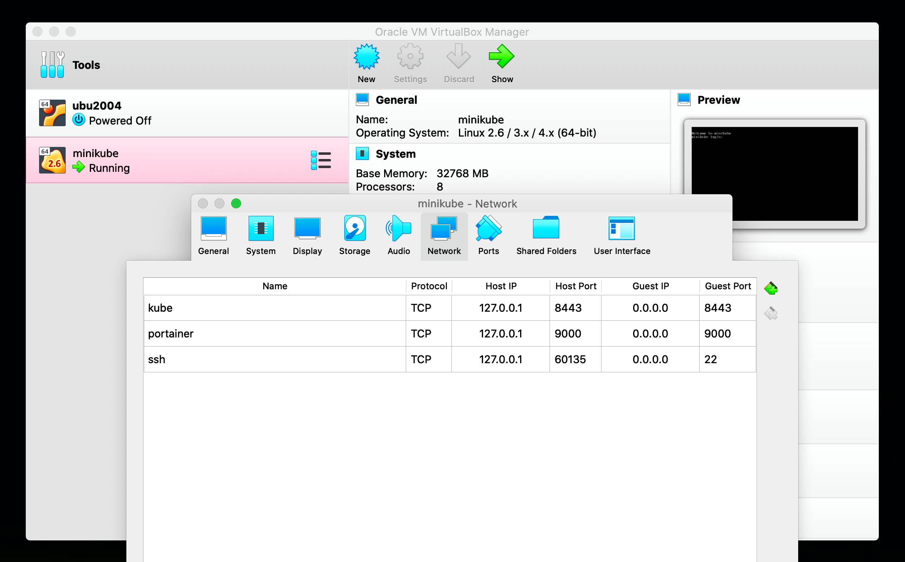
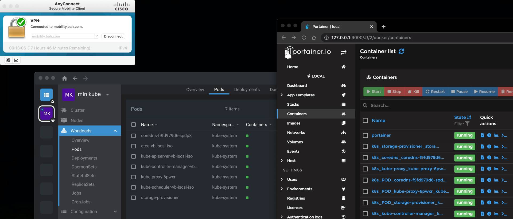

# Installing `minikube`

_Prerequisites: `brew` package manager installed._  
  
  # Install a `minikube` driver

A hypervisor driver is required to use `minikube`, so why not use the most lightweight and fastest one available on your Mac? _Bonus: [hyperkit](https://github.com/moby/hyperkit) is the open source version of the proprietary hypervisor driver used in Docker Desktop for Mac._

```
brew install hyperkit
```

You can verify hyperkit installed properly:

```
$ hyperkit -v
hyperkit: 0.20200908 

Homepage: https://github.com/docker/hyperkit
License: BSD
```

# Install docker-cli

```
brew install docker
```

This will install *ONLY* the docker-cli and not the full Docker Desktop that is installed with the `brew install --cask docker` commmand.  
  
You can verify the absence of a docker daemon / only the docker cli command installed if you would like:

```
$ docker info
Client:
 Context:    default
 Debug Mode: false
  
Server:
ERROR: Cannot connect to the Docker daemon at unix:///var/run/docker.sock. Is the docker daemon running?
```

# Install kubectl

Kubernetes just isn't kubernetes without _cube cuddle_:

```
brew install kubectl
```

# Install `minikube` (and docker-daemon)

Install the app before we create a kubernetes cluster and launch the docker-daemon:

```
brew install minikube
```

Set the number of cpu's, memory, and disk size for `minikube` to utilize in its hyperkit VM:

```
minikube config set cpus 8
minikube config set memory 32G
minikube config set disk-size 64G
```

## minikube drivers
We can run `minikube` inside a VM, inside a container, or on a thin bare-metal hypervisor. There are several drivers available as documented [here](https://minikube.sigs.k8s.io/docs/drivers/).  We are going to choose hyperkit since it is the most lightweight and performant option.

## container runtimes
Options: [dockerd](https://docs.docker.com/engine/reference/commandline/dockerd/), [containerd](https://containerd.io/), and [cri-o](https://cri-o.io/). We want to build docker images locally, so we choose: docker.

## Start the kubernetes cluster

BigBang requires the use of kubernetes version 1.19, so we tell `minikube` to use this specific version.

```
minikube start --kubernetes-version=1.19.14 --driver=hyperkit --container-runtime=docker
```

## (optional) mapping docker volumes to host

Add this to the `minikube` start command if you need to access the docker volumes directly on your host/mac:

```
--mount --mount-string="/private/var/services/:/private/var/services/"
```

## (optional) starting `minikube` without a k8s cluster

If you only want docker-daemon and no kubernetes cluster, you can add this flag that was added as of `minukube` 1.24 that allows `minikube` to run the docker daemon without starting a cluster. This may be useful if say, for example, you want to run `k3d` instead for your k8s cluster or if you just want to do local docker development:

```
--no-kubernetes
```

# Verify your kubernetes cluster is running

```
$ kubectl get nodes
NAME       STATUS   ROLES    AGE     VERSION
minikube   Ready    master   3h10m   v1.19.14
```

# Using docker-cli

In order to use the `docker` command in a shell (docker-cli) you must set the appropriate environmental variables:

```
eval $(minikube docker-env)
```

You will need to execute the above command with every new command shell/tab/tmux window you open unless you add the following to your ~/.bashrc
```
minikube status > /dev/null && eval $(minikube docker-env)
```

You can then verify docker-cli is using the `minikube` docker daemon:

```
$ docker info
Client:
 Context:    default
 Debug Mode: false

Server:
 Containers: 15
  Running: 14
  Paused: 0
  Stopped: 1
 Images: 10
 Server Version: 20.10.8...
 ```
 
# Optional installs

Docker compose
```
brew install docker-compose
```
[k9s](https://github.com/derailed/k9s) is a shell front-end for managing a k8s cluster:
```
brew install k9s
```
Assistance for logging into container registries
```
brew install docker-credential-helper
```
 


# Other useful bits
 
## Cluster ip

When accessing resources on your cluser, it's helpful to know what the ip address of your cluster is:
```
$ minikube ip
192.168.64.5
```

## Metrics Server

The metrics server addon for `minikube` provides a great deal of information about your cluster to Portainer and other cluster clients.
```
minikube addons enable metrics-server
```

## Accessing the minikube VM

If you find you need to dive deeper, you can `ssh` into the hyperkit / `minikube` VM:

```
minikube ssh
```

## Starting and stopping the cluster

The _pause_ command will stop / freeze the kubernetes cluster but will not delete the Hyperkit VM or cluster deployments. The other benefit of using the _pause_ command is that the docker daemon will continue running -- so you can continue using docker-cli, docker-compose, building images, etc...  

```
minikube pause
```

Use the unpause command to resume the cluster and un-freeze your cluster. Utilizing pause / unpause will allow the k8s cluster and deployments to persist across host machine reboots.
```
minikube unpause
```

In order to completely erase every trace of the k8s cluster and docker (useful for starting over with a clean slate) use the delete command followed by another start command:

```
minikube delete
```


# Caveats of the `minikube stop` command
  
If you use the `minikube stop` command instead of pause / unpause -- the deployed containers will be stopped and replaced by new containers when you run a subsequent `minukube start` command.  
  

# Known Issues

## Cisco VPN

`minikube` prefers to exist on its own bridged subnet. The bridged subnet `minikube` creates is not a part of your local LAN subnet. This separate subnet configuration causes the issue of not being able to reach `minikube`’s resources while on the Cisco VPN.  

There are two workarounds for this issue:  

1) Perform local dev work with VPN off interacting with your local cluster as normal and only connect to VPN as necessary when interacting with the loca cluster is not necessary.
2) Use `--driver=virtualbox` as a VM backend instead of hyperkit. Then, port forward the kube management service (port 8443) and any other additional services that need to be exposed to `127.0.0.1` (localhost). *IMPORTANT: The VPN MUST BE OFF during the initial `minikube start` command or the cluster will not start up correctly.* The VPN can be turned on after minikube has successfully started up.



While connected to the Cisco VNP, `minikube`'s services are not available on the new subnet it creates. However, with ports exposed, they can be reached via localhost instead. In order to use Lens or other apps that interact with the cluster management service (8443) directly, you may have to update the ip address for the `minikube` cluster in your `~/.kube/config` file.


   
The tradeoff: the hyperkit driver is faster/more performant than VirtualBox, but with VirtualBox, you get the added flexibility of finer grained networking configuration.

## iscsi not available in the `minikube` VM

Some deployments, [Longhorn](https://longhorn.io) in particular, rely on the iscsi kernel modules and corresponding iscsi system apps being present in the `minikube` VM. A workaround for this is detailed here: https://github.com/589290/minikube-with-iscsi
