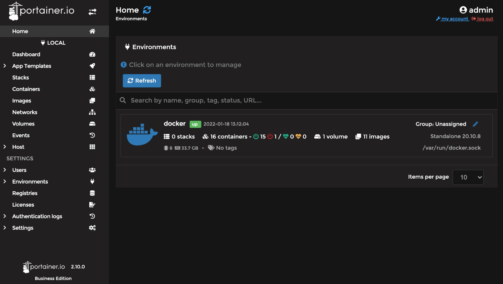
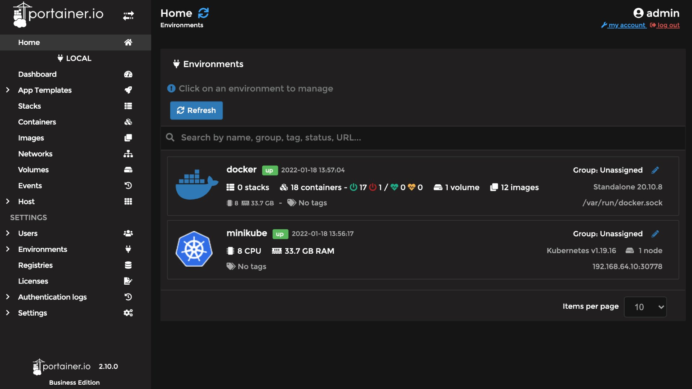

# Portainer

[Portainer](https://www.portainer.io/) is a wonderful webUI front-end for managing docker and / or Kubernetes. You can also get a free 5-node cluster enterprise license on their website just by registering. If you prefer not to register, you can optionally use the community edition (substitute -ce for -ee in the docker command).

## Installing portainer for the docker daemon  

The below will deploy an instance of Portainer as a docker container.

```
docker run -d \
  --restart always \
  --name portainer \
  -p 0.0.0.0:8000:8000 \
  -p 0.0.0.0:9000:9000 \
  -p 0.0.0.0:9443:9443 \
  -v portainer-data:/data \
  -v /var/run/docker.sock:/var/run/docker.sock \
  portainer/portainer-ee
```
Afterwards, determine your cluster ip

```
minikube ip
```
...and  then login to the Portainer webui by visting port 9000 on the cluster ip: [http://192.168.64.10:9000](http://192.168.64.10:9000)

Next you will set an admin password and then choose the option to work with the local environment. YOu will then arrive to the Portainer home screen:



From here you can work with containers, images, volumes, networks, etc... and manage your local docker environment.

## Deploying portainer on your local kubernetes cluser

In order to manage the kubernetes side of your local cluster we'll have to setup portainer there as well. We'll use a NodePort service per the documentation here [https://docs.portainer.io/v/ce-2.11/start/install/agent/kubernetes/baremetal](https://docs.portainer.io/v/ce-2.11/start/install/agent/kubernetes/baremetal)

```
curl -L https://downloads.portainer.io/portainer-agent-ee210-k8s-nodeport.yaml -o portainer-agent-k8s.yaml ;
kubectl apply -f ./portainer-agent-k8s.yaml ;
```

Once the Portainer app is deployed, navigate to the Environments section of the Portainer webui and add a new environment using the Portainer Agent / NodePort option. Enter a for the environment and tell it to use the minikube ip on port 30778 for the Environment URL. All the default choices on the next screen can be used.

```
192.168.64.10:30778
```

The above is the proper format for an Environment URL ~ can be tricky to guess this if you haven't figured it out previously. Your new Kubernetes environment is now available to manage under Portainer!


