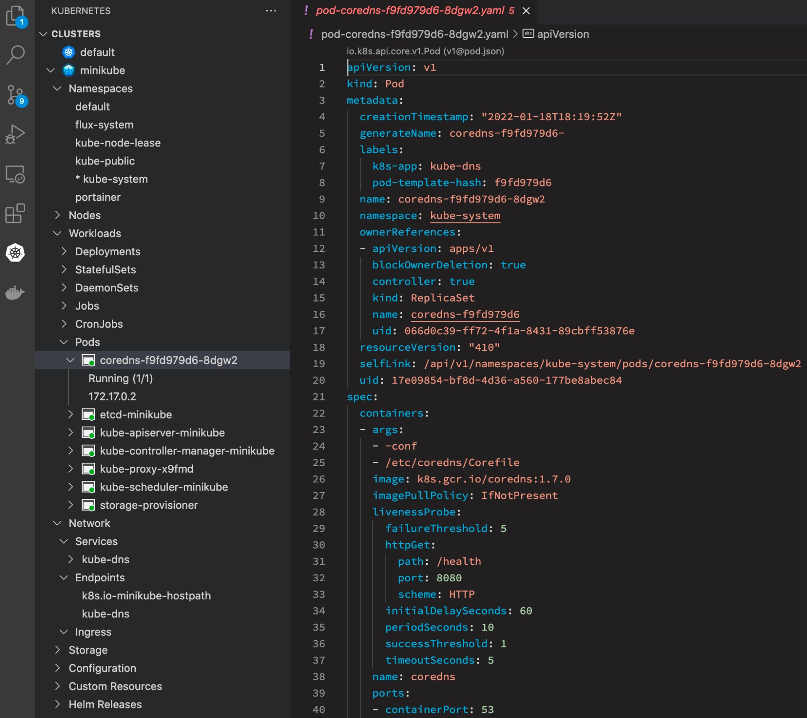
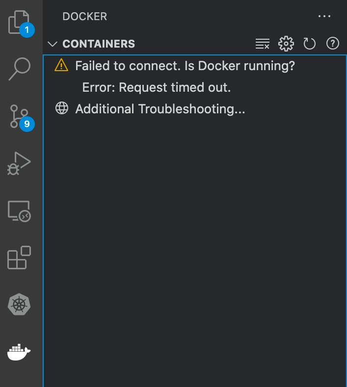
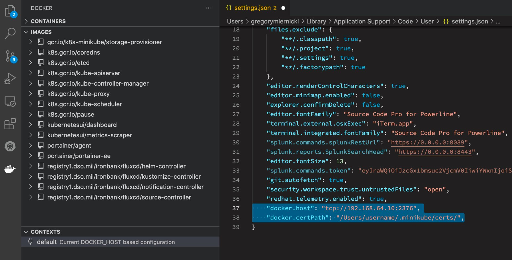

# Configuring VScode for minikube/docker

Configuring VScode for Kubernetes is straightforward, just install the extension and it should pick up the context allowing you access to the local cluster's resources:



However, yoy may find that when you install the Docker extension in VScode that it is unable to conect to the local docker daemon, as below:



The solution to this problem is to inform VScode where minikube keeps its certs so that VScode can connect. Open the settings.json file in VScode by using Command-Shift-P and searching for `settings.json`. Open this file and append the following two lines substituting your ip and username:

```
    "docker.host": "tcp://192.168.64.10:2376",
    "docker.certPath": "/Users/username/.minikube/certs/"
```

Save the settings file, and the go back to the Docker extension. Click refresh, and it should now be able to access the local docker resources.



Happy local clustering!